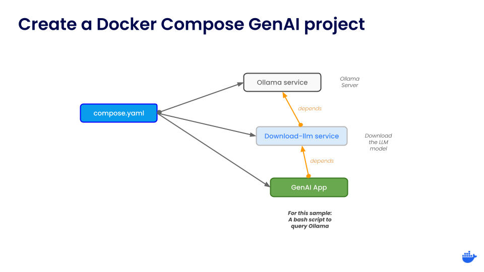
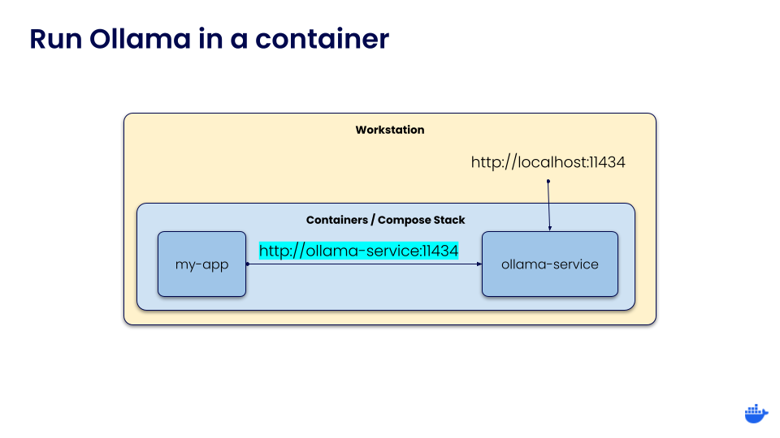
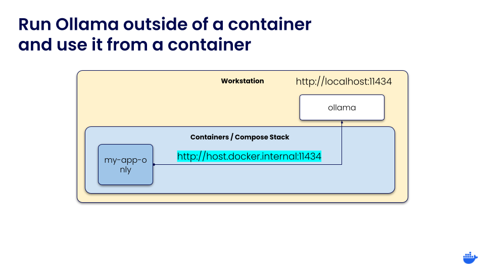
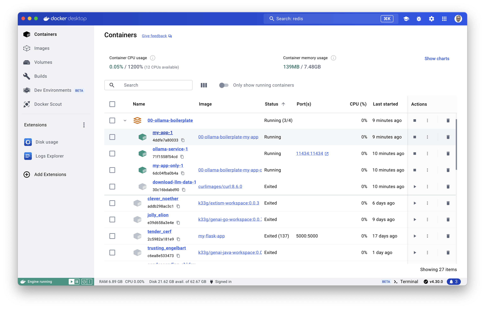
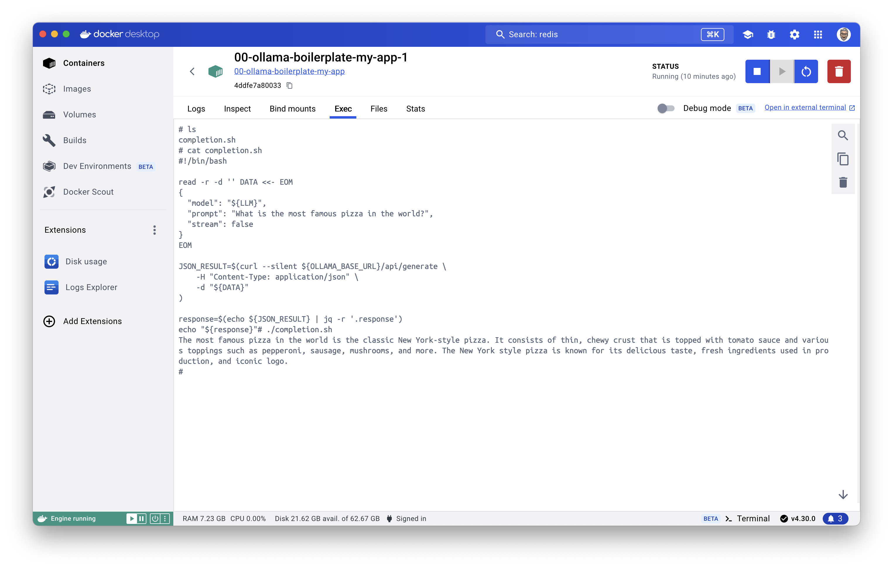

# Ollama and Docker Compose
> How to initialize a Docker Compose GenAI project with Ollama

## Requirements

- Docker Desktop
- Ollama (optional if you use the Ollama Docker image)

## Architecture



## How to Start the Docker Compose GenAI project

There are two ways to start the Docker Compose project:

### Ollama is running in a container
If you run Ollama from a container, you can use the following command:

```bash
OLLAMA_BASE_URL=http://ollama-service:11434 LLM=qwen:0.5b \
docker compose --profile ollma-in-docker up -d
```
> - 👋 this profile: `--profile ollma-in-docker` allows to start the three Docker Compose services:
>   - `ollama-service`: Ollama in a container.
>   - `download-llm-data`: download the LLM data (and exit once the download is complete).
>   - `my-app`: your application (a simple Ubuntu container with a bash script to query Ollama).
> - 📝 `OLLAMA_BASE_URL` is the URL to access the Ollama service.
> - 📝 `LLM` is the name of the LLM you want to use (and download).
> - ✋ Ollama can run with GPU acceleration inside Docker containers for Nvivia GPUs. See the [Turn on GPU access with Docker Compose](https://docs.docker.com/compose/gpu-support/) for more information.

Then the container of your application, will be able to access the Ollama service with this URL: http://ollama-service:11434.



### Ollama is running locally (not in a container == native installation)

```bash
OLLAMA_BASE_URL=http://host.docker.internal:11434 LLM=qwen:0.5b \
docker compose --profile application up -d

OLLAMA_BASE_URL=http://bob.local:11434 LLM=qwen:0.5b \
docker compose --profile application up -d
# add 192.168.86.28 bob.local to hosts file if necessary
# for example if you run the app from the Mac and if Ollama is on the Pi
```
> - 👋 This time only one service will be started, the Docker Compose service related to your application:
>   - `my-app-only`: your application (the same simple Ubuntu container with a bash script to query Ollama).

Then the container of your application, will be able to access the local Ollama service with this URL: http://host.docker.internal:11434.



## How to use the Docker Compose GenAI project

Once the Docker Compose project started, open the Docker Desktop GUI and click on the name of the `my-app-1` service to "enter" into the container:


Then, select the **Exec** tab, you can type various commands to interact with the container:


If you run the `./completion.sh` script, it will query Ollama, and some moment after, you will see the completion:


Now, you can add your scripts or modifiy this one.
