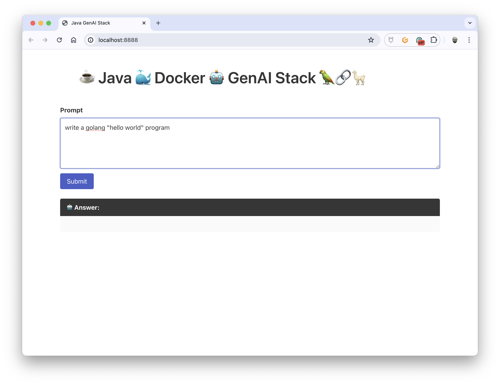
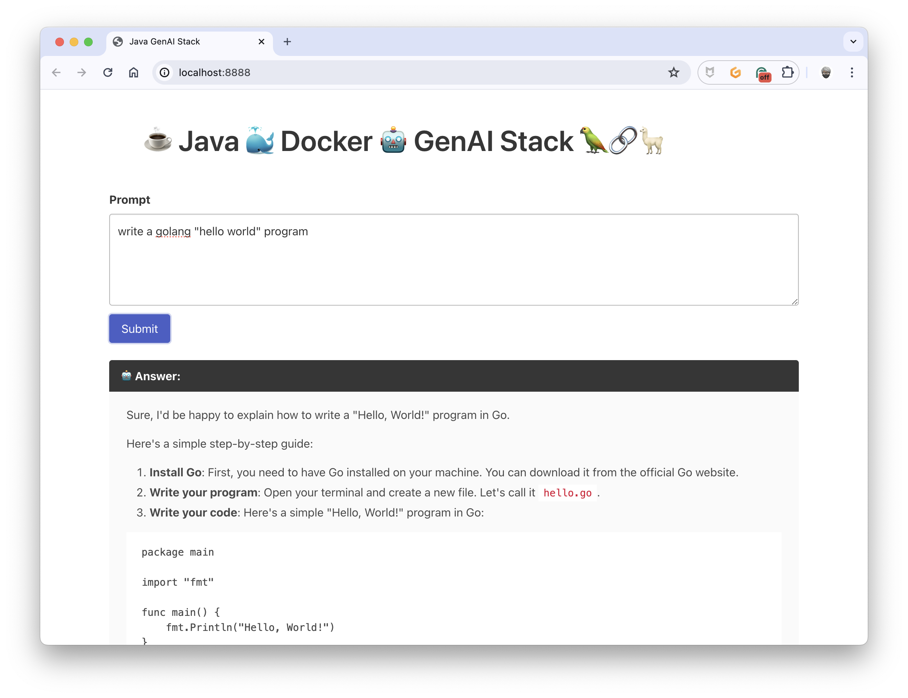

# Java Docker GenAI Stack ☕️🐳🤖🦜🔗🦙
> 👋 on the Pi, add this `127.0.0.1 host.docker.internal` to `/etc/hosts`
## Run all in containers

```bash
HTTP_PORT=8888 LLM=deepseek-coder OLLAMA_BASE_URL=http://ollama:11434 docker compose --profile container up
```
> The first time only, you must wait for the complete downloading of the model.

## Use the native Ollama install (like on macOS)

> To do for the first time only:
```bash
LLM=deepseek-coder ollama pull ${LLM}
```

```bash
HTTP_PORT=8888 LLM=deepseek-coder OLLAMA_BASE_URL=http://host.docker.internal:11434 docker compose --profile webapp up
```

## Use the GPU from the Ollama container on Linux or Windows

> 🚧 This is a work in progress

## Query Ollama

```bash
curl -H "Content-Type: application/json" http://localhost:8080/prompt \
-d '{
  "question": "what are structs in Golang?"
}'
```

## Rebuild the WebApp image

> All in containers
```bash
HTTP_PORT=8888 LLM=deepseek-coder OLLAMA_BASE_URL=http://ollama:11434 docker compose --profile container up --build
```

> Use the Ollama local install (like on macOS)
```bash
HTTP_PORT=8888 LLM=deepseek-coder OLLAMA_BASE_URL=http://host.docker.internal:11434 docker compose --profile webapp up --build
```

## Development mode

For developping the application, use the `watch` command of Docker Compose

> All in containers
```bash
HTTP_PORT=8888 LLM=deepseek-coder OLLAMA_BASE_URL=http://ollama:11434 docker compose --profile container watch
```
> Use the Ollama local install (like on macOS)
```bash
HTTP_PORT=8888 LLM=deepseek-coder OLLAMA_BASE_URL=http://host.docker.internal:11434 docker compose --profile webapp watch
```

## How to use the WebApp

Write a prompt:



And get a response:

